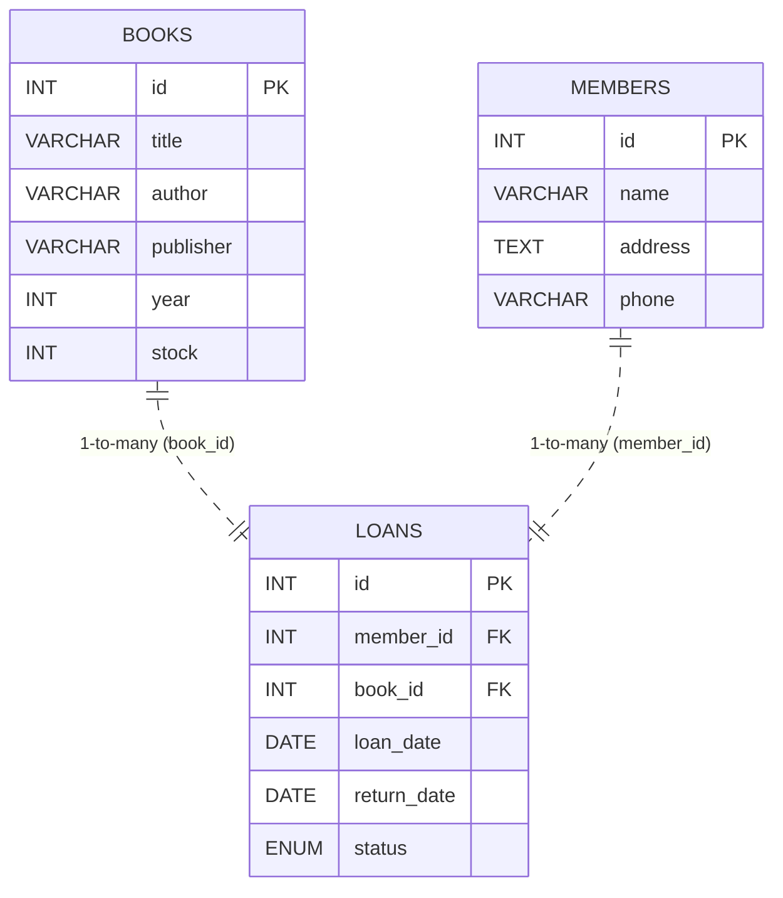

# Sistem Peminjaman Buku
> Rekontruksi dari project semester 2 tentang mata kuliah database
> Project menggunakan backend Flask + MySQL (XAMPP).

---

## Teknologi

* Backend: Python 3.10+ (Flask)
* Database: MySQL (via XAMPP)
* ORM: SQLAlchemy
* API Format: JSON (REST)
* Tools: Postman / Thunder Client

---

## Struktur folder

```
/project
  /config
    config.py
  /models
    models.py
  /controllers
    books_controller.py
    members_controller.py
    loans_controller.py
  /routes
    books.py
    members.py
    loans.py
  app.py
  requirements.txt
  .env.example
  database.sql
  ERD.md
  README.md
```


## ERD (mermaid)

Simpan diagram ini di `ERD.md` atau render di Markdown viewer yang mendukung mermaid.




## Validasi penting (sudah diimplementasi):

* Buku tidak boleh dibuat dengan `stock < 0`.
* Saat membuat pinjaman, system memeriksa `Member` dan `Book` harus ada.
* Jika `book.stock == 0` → response `400` dengan `{"error":"Book is out of stock"}`.
* Tidak boleh mengembalikan pinjaman yang sudah `returned`.

---

## Contoh request (curl)

* Create book

```
curl -X POST http://localhost:5000/books -H "Content-Type: application/json" -d '{"title":"Belajar Flask","author":"Admin","stock":3}'
```

* Create member

```
curl -X POST http://localhost:5000/members -H "Content-Type: application/json" -d '{"name":"Andi","phone":"0812"}'
```

* Create loan

```
curl -X POST http://localhost:5000/loans -H "Content-Type: application/json" -d '{"member_id":1,"book_id":1}'
```

* Return loan

```
curl -X PUT http://localhost:5000/loans/1/return
```

---

## Screenshot & Dokumentasi

Sertakan screenshot dari Postman/Thunder Client yang menunjukkan:

1. CRUD Books (POST, GET, PUT, DELETE)
2. CRUD Members
3. Pembuatan loan (stok berkurang)
4. Pengembalian loan (stok bertambah)

---

## Catatan deployment / testing

* Pastikan MySQL (XAMPP) berjalan dan kredensial di `.env` benar.
* Jalankan `python -m venv venv && source venv/bin/activate` (Windows: `venv\Scripts\activate`), `pip install -r requirements.txt`.
* Import `database.sql` via phpMyAdmin atau jalankan `mysql -u root < database.sql`.
* Jalankan `python app.py` dan akses `http://localhost:5000`.

---


